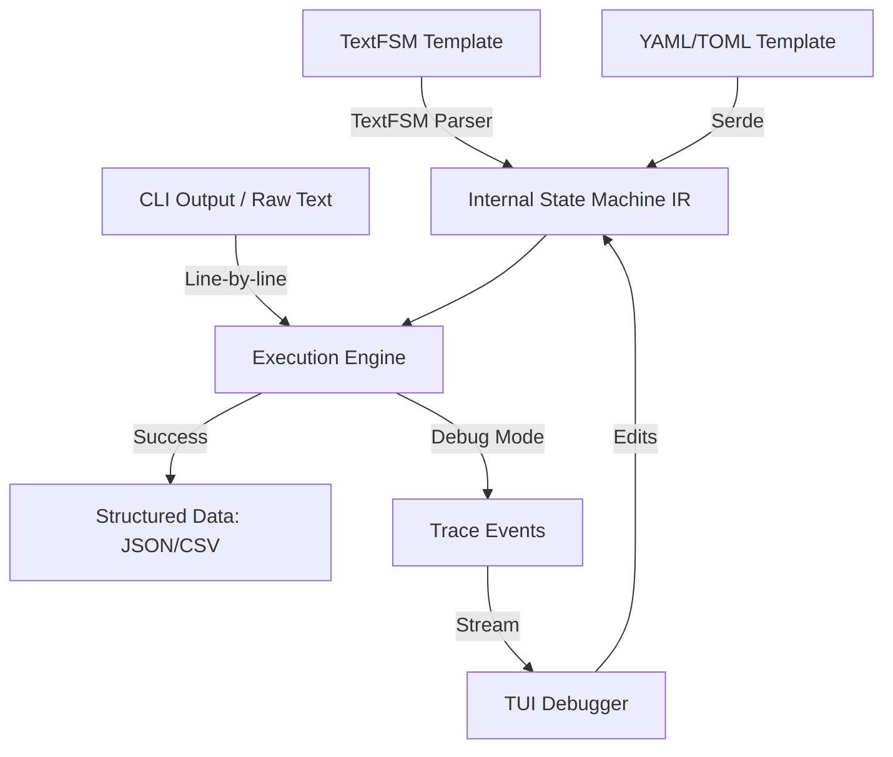

# Architecture Patterns: cliscrape

**Domain:** Network CLI Scraping & Parsing
**Researched:** 2024-10-24
**Overall Confidence:** HIGH

## Recommended Architecture

`cliscrape` should follow a **Modular Parser Engine** architecture with a clear separation between the **State Machine IR (Intermediate Representation)**, the **Front-end Parsers (TextFSM/YAML/TOML)**, and the **Execution Backend**.

### High-Level Component Diagram



### Component Boundaries

| Component | Responsibility | Communicates With |
|-----------|---------------|-------------------|
| `cliscrape-core` | Defines the State Machine IR, `Value` types, and the `Engine` that executes rules against text. | `cliscrape-parsers`, `cliscrape-tui` |
| `cliscrape-parsers` | Frontend modules for `.textfsm`, `.yaml`, and `.toml`. Compiles these formats into the Core IR. | `cliscrape-core` |
| `cliscrape-tui` | A `ratatui`-based interactive debugger. Handles live-reloading, execution tracing, and state visualization. | `cliscrape-core`, `cliscrape-parsers` |
| `cliscrape-cli` | The command-line interface. Orchestrates parsing jobs and launches the TUI. | All components |
| `cliscrape-transport` | (Optional) Handles SSH/Telnet connectivity to live devices via `ferrissh` or `russh`. | `cliscrape-cli` |

### Data Flow

1. **Compilation Phase:** The template (in any format) is parsed and validated. It is transformed into an `ExecutionPlan` containing `Values` (with regexes) and `States` (with rules).
2. **Execution Phase:** The `Engine` takes the `ExecutionPlan` and raw text. It processes text line-by-line.
3. **State Transition:** For each line, the `Engine` checks the rules in the current `State`. If a rule matches:
    * Variables are extracted.
    * Actions (e.g., `Record`, `Filldown`, `Clear`) are applied to the `Context`.
    * If a transition is specified, the `Engine` moves to the `NextState`.
4. **Tracing (Debug Only):** If tracing is enabled, every match attempt, variable binding, and state change emits a `TraceEvent` into a channel.
5. **Output:** Once all lines are processed, the `Engine` returns a collection of `Records`.

## Patterns to Follow

### Pattern 1: State Machine IR
Instead of coupling the execution logic to the TextFSM syntax, define an internal IR. This allows the YAML/TOML formats to be first-class citizens.
**Example IR Structure:**
```rust
struct StateMachine {
    values: Vec<ValueDefinition>,
    states: HashMap<String, State>,
}

struct Rule {
    regex: Regex,
    actions: Vec<Action>,
    next_state: Option<String>,
}
```

### Pattern 2: Event-Driven Tracing for TUI
The `Engine` should accept a `TracingSubscriber` trait. In normal CLI mode, this is a no-op. In TUI mode, it sends events to the UI thread.
```rust
trait TracingSubscriber {
    fn on_rule_match(&self, rule: &Rule, line: &str, captures: &Captures);
    fn on_state_transition(&self, from: &str, to: &str);
}
```

### Pattern 3: Hot-Reloading via TUI Loop
The TUI should use an "App State" that includes the raw template string. On every edit, it attempts to re-compile and re-run the engine.
**Rationale:** Rust's speed allows re-parsing even large outputs (thousands of lines) in milliseconds, providing an "instant" feedback loop for template developers.

## Anti-Patterns to Avoid

### Anti-Pattern 1: Direct TextFSM Execution
**What:** Writing the engine to directly interpret `.textfsm` files.
**Why bad:** Makes it impossible to support YAML/TOML without duplicating logic.
**Instead:** Compile all formats to a common IR.

### Anti-Pattern 2: Global State in Engine
**What:** Using global variables for the current state or extracted values.
**Why bad:** Prevents concurrent parsing of multiple outputs and makes testing difficult.
**Instead:** Pass a `Context` object through the engine or keep the engine instance-based.

## Suggested Build Order

1. **Phase 1: `cliscrape-core` (IR + Engine)**
   * Define the core data structures and the execution logic.
   * Implement basic TextFSM actions (`Filldown`, `Record`, `Continue`).
2. **Phase 2: `cliscrape-parsers` (TextFSM Frontend)**
   * Build a parser for the legacy TextFSM DSL.
   * Verify against `ntc-templates` test data.
3. **Phase 3: `cliscrape-cli` (The Basic Tool)**
   * A simple CLI to take a template + file and output JSON.
4. **Phase 4: `cliscrape-tui` (The Debugger)**
   * Implement the `ratatui` interface with a live execution trace.
   * Add file-watching/live-reload for templates.
5. **Phase 5: Modern Frontends (YAML/TOML)**
   * Add `serde`-based parsers for the hybrid modern formats.
6. **Phase 6: Transport Integration**
   * Integrate `ferrissh` for live scraping from network devices.

## Sources

- [TextFSM Documentation](https://github.com/google/textfsm/wiki/TextFSM) (HIGH Confidence)
- [`textfsm-rust` Implementation Analysis](https://github.com/clint-at-twosigma/textfsm-rust) (HIGH Confidence)
- [Ratatui Architecture Patterns](https://ratatui.rs/concepts/architecture/) (HIGH Confidence)
- [Ferrissh/Netmiko/Scrapli Comparison](https://lib.rs/crates/ferrissh) (MEDIUM Confidence)
