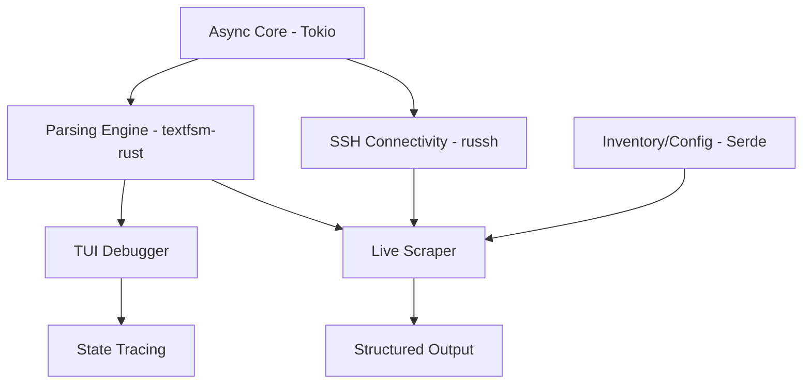

# Feature Landscape

**Domain:** Network CLI Scraping & Parsing
**Researched:** 2024-11-21
**Overall Confidence:** HIGH

## Table Stakes

Features users expect in any network scraping/parsing tool. Missing these makes the tool non-viable for production.

| Feature | Why Expected | Complexity | Notes |
|---------|--------------|------------|-------|
| **Multi-Vendor SSH** | Networks are heterogeneous (Cisco, Juniper, etc.). | High | Handled via `russh`. Needs to handle diverse cipher suites and prompts. |
| **TextFSM Compatibility** | Thousands of existing templates in the ecosystem (e.g., `ntc-templates`). | Medium | Critical for migration. 99%+ compatibility required. |
| **JSON/YAML Export** | Downstream tools (Ansible, NetBox) consume structured data. | Low | Handled via `serde`. |
| **Prompt Management** | SSH sessions hang if `--More--` or `[confirm]` prompts aren't handled. | Medium | Requires robust state detection in the SSH stream. |
| **Inventory Management** | Must be able to define targets, credentials, and groupings. | Low | Using YAML/TOML for modern configuration. |
| **Concurrent Execution** | Scraping 1,000 switches sequentially is too slow. | Medium | Leverages Rust's `tokio` for high-performance async I/O. |

## Differentiators

Features that set `cliscrape` apart from incumbent Python-based tools.

| Feature | Value Proposition | Complexity | Notes |
|---------|-------------------|------------|-------|
| **TUI Debugger** | Visualizing regex matches and state transitions live. | High | Using `ratatui`. Solves the biggest pain point in template development. |
| **Live State Tracing** | See *how* the TextFSM state machine moves through the text. | Medium | Uses `tui-logger` and `tracing` to visualize engine internals. |
| **Rust Performance** | Single binary, instant startup, 10x lower memory than Python. | Low | Excellent for ephemeral CI/CD runners and containers. |
| **Hybrid Config** | Flexible mapping of commands to templates via YAML/TOML. | Low | More readable than TextFSM's legacy `index` file format. |
| **Local Template Testing** | Test templates against text files without a live device. | Low | Essential for "offline" development. |

## Anti-Features

Features to explicitly NOT build to maintain focus and performance.

| Anti-Feature | Why Avoid | What to Do Instead |
|--------------|-----------|-------------------|
| **Config Management** | Pushing config is a different domain (idempotency, rollbacks). | Focus on "Read-Only" scraping and state verification. |
| **Web Dashboard** | Adds massive complexity, security surface, and binary size. | Keep it a CLI/TUI tool. Export data to specialized dashboards. |
| **Telnet Support** | Deprecated, insecure, and adds legacy baggage. | Stick to SSH. Support modern protocols only. |
| **Embedded Scripting** | We shouldn't compete with Python/Nornir/Ansible. | Be a fast "Unix-style" tool that outputs JSON for other scripts. |

## Feature Dependencies

## MVP Recommendation

For the MVP, prioritize:
1. **Core SSH Engine:** Basic connectivity and prompt handling for Cisco IOS/NX-OS.
2. **TextFSM Compatibility:** Parsing live output into JSON.
3. **Basic TUI Debugger:** The "killer feature" to prove the value proposition early.
4. **Local Template Testing:** Ability to run `cliscrape parse template.fsm output.txt`.

Defer to post-MVP:
- Full state-tracing visualization (start with simple logs).
- Complex multi-step prompt handling (e.g., interactive password changes).
- Advanced inventory grouping (start with a simple list).

## Sources

- [Netmiko & TextFSM Documentation](https://github.com/ktbyers/netmiko) (Table stakes reference)
- [Scrapli Performance Comparison](https://github.com/scrapli/scrapli) (Performance rationale)
- [TextFSM GitHub Issues](https://github.com/google/textfsm/issues) (Common pain points / Debugging needs)
- [Ratatui Ecosystem](https://ratatui.rs/) (TUI feasibility)
